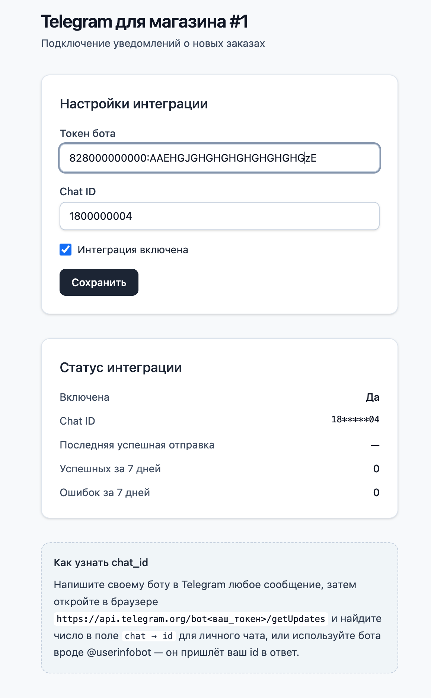
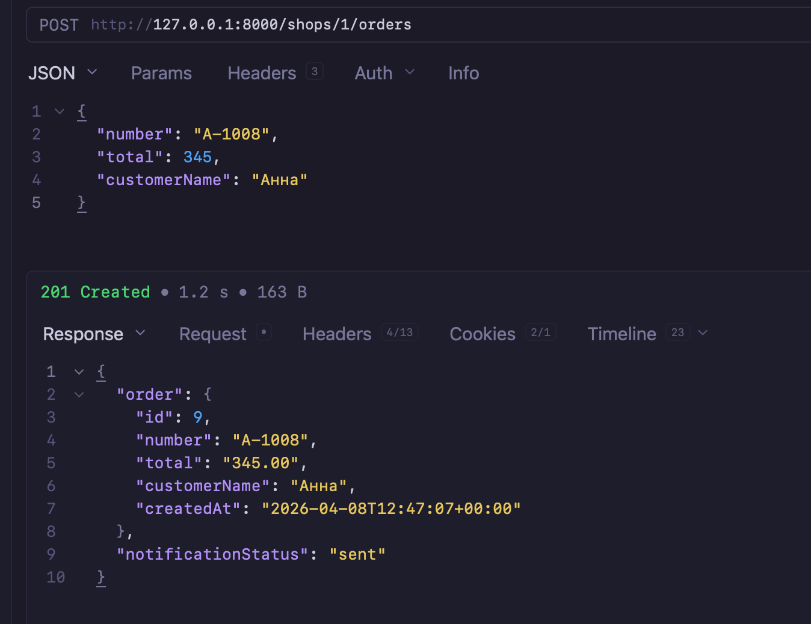
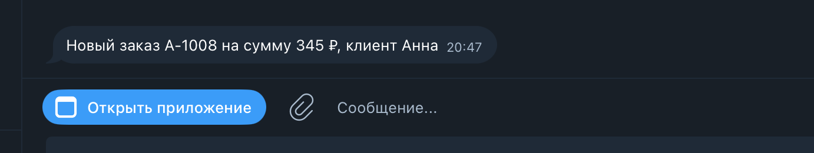

# Posiflora — MVP интеграции Telegram

Backend на Symfony 8 и фронтенд в `**frontend/**` (Vite + React + TypeScript). Подробные требования и план работ — в каталоге [doc/](doc/).

## Быстрый старт (разработка)

1. Установить зависимости: `composer install`
2. Поднять инфраструктуру: `docker compose up -d` (PostgreSQL на порту **5432**, см. [compose.override.yaml](compose.override.yaml))
3. Убедиться, что строка `DATABASE_URL` в `.env` или `.env.local` совпадает с учётными данными контейнера. Значения по умолчанию в Compose: пользователь и база `postgre`, пароль `postgre`, хост с хост-машины `127.0.0.1`, порт `5432` — как в шаблоне `.env`.
4. Запуск веб-сервера для разработки: `symfony server:start` (или настройте свой vhost на `public/`).

Расширенные сценарии (Symfony CLI, работа с БД из консоли) описаны в [doc/README.md](doc/README.md).

## Docker: разработка и продакшен


| Режим          | Команда                                                             | Что поднимается                                                                                                                                                                                                 |
| -------------- | ------------------------------------------------------------------- | --------------------------------------------------------------------------------------------------------------------------------------------------------------------------------------------------------------- |
| **Разработка** | `docker compose up -d`                                              | `compose.yaml` + `**compose.override.yaml`**: PostgreSQL (порт **5432** на хосте), Mailpit. Backend и фронтенд запускаются вручную на машине (Symfony CLI, `npm run dev`).                                      |
| **Продакшен**  | `docker compose -f compose.yaml -f compose.prod.yaml up -d --build` | Только `**compose.yaml`** и `**compose.prod.yaml`**: PostgreSQL без проброса порта наружу, контейнеры **backend** и **frontend**. Порты приложений: **8080** (UI и прокси API), **8000** (прямой доступ к API). |


Остановка прод-стека:

```bash
docker compose -f compose.yaml -f compose.prod.yaml down

```

При старте backend выполняются миграции Doctrine; отключить можно переменной `SKIP_DB_MIGRATIONS=1` в сервисе backend (не рекомендуется без ручного прогона миграций). Для продакшена задайте сильный `**APP_SECRET**` и надёжные `**POSTGRES_***` через переменные окружения или `.env` на сервере (не коммитьте секреты).

После старта прод-стека: UI — **[http://127.0.0.1:8080](http://127.0.0.1:8080)** (например `/shops/1/growth/telegram`). Запросы к `/shops/{id}/telegram/...` и `/shops/{id}/orders` с порта 8080 проксируются nginx фронта в **backend**. Прямой доступ к Symfony — **[http://127.0.0.1:8000](http://127.0.0.1:8000)**.

Образы: [docker/backend/](docker/backend/), [docker/frontend/](docker/frontend/).

## Фронтенд

1. Установить [Node.js](https://nodejs.org/) (LTS) и использовать npm из состава Node.
2. В каталоге проекта: `cd frontend && npm install`
3. Если API открывается с другого origin (типично: Symfony на порту **8000**, Vite на **5173**), скопируйте `frontend/.env.example` в `frontend/.env` и задайте `VITE_API_BASE_URL` на базовый URL API (без завершающего слэша), например `http://127.0.0.1:8000`.
4. Запуск дев-сервера: `npm run dev`. Маршрут экрана настроек Telegram совпадает с [ТЗ](doc/ТЗ.md); детали стека и структуры кода — в [doc/Frontend.md](doc/Frontend.md). Краткий отчёт по фазе 5 — [doc/Что сделано - фаза 5.md](doc/Что%20сделано%20-%20фаза%205.md).

Сборка и проверка статики: `npm run build`; локальный просмотр сборки: `npm run preview`.

## Переменные окружения

- `**DATABASE_URL`** — подключение Doctrine к PostgreSQL; переопределения без коммита — в `.env.local`.
- `**TELEGRAM_USE_REAL_API`** — переключение режима отправки в Telegram:
  - `false` (по умолчанию) — мок без обращения к сети (удобно для локальной разработки и тестов);
  - `true` — реальные вызовы Bot API через `App\Telegram\HttpTelegramClient`.

Параметр контейнера: `telegram.use_real_api` (см. [config/services.yaml](config/services.yaml)).

## Скриншоты

Экран настроек Telegram для магазина (токен, chat_id, статус интеграции):



Создание заказа через API и ответ с `notificationStatus`:



Уведомление о новом заказе в Telegram:



## Тесты (backend)

Интеграционные тесты — PHPUnit, каталог [tests/](tests/), конфигурация [phpunit.dist.xml](phpunit.dist.xml). Нужны PHP и зависимости из `composer.json` (локально — как минимум **PHP ≥ 8.4**).

1. Убедитесь, что PostgreSQL доступен с хоста (обычно `docker compose up -d` из быстрого старта).
2. Для окружения `test` к имени базы из `DATABASE_URL` Symfony добавляет суффикс **`_test`** (см. [config/packages/doctrine.yaml](config/packages/doctrine.yaml)), например `postgre` → `postgre_test`. Один раз создайте эту базу и накатите миграции:

   ```bash
   APP_ENV=test php bin/console doctrine:database:create --if-not-exists
   APP_ENV=test php bin/console doctrine:migrations:migrate --no-interaction
   ```

3. В **`.env.test`** для стабильного прогона без обращений к Telegram задайте **`TELEGRAM_USE_REAL_API=false`** (иначе возможны таймауты на вызовах Bot API).
4. Из корня репозитория:

   ```bash
   php bin/phpunit
   ```
