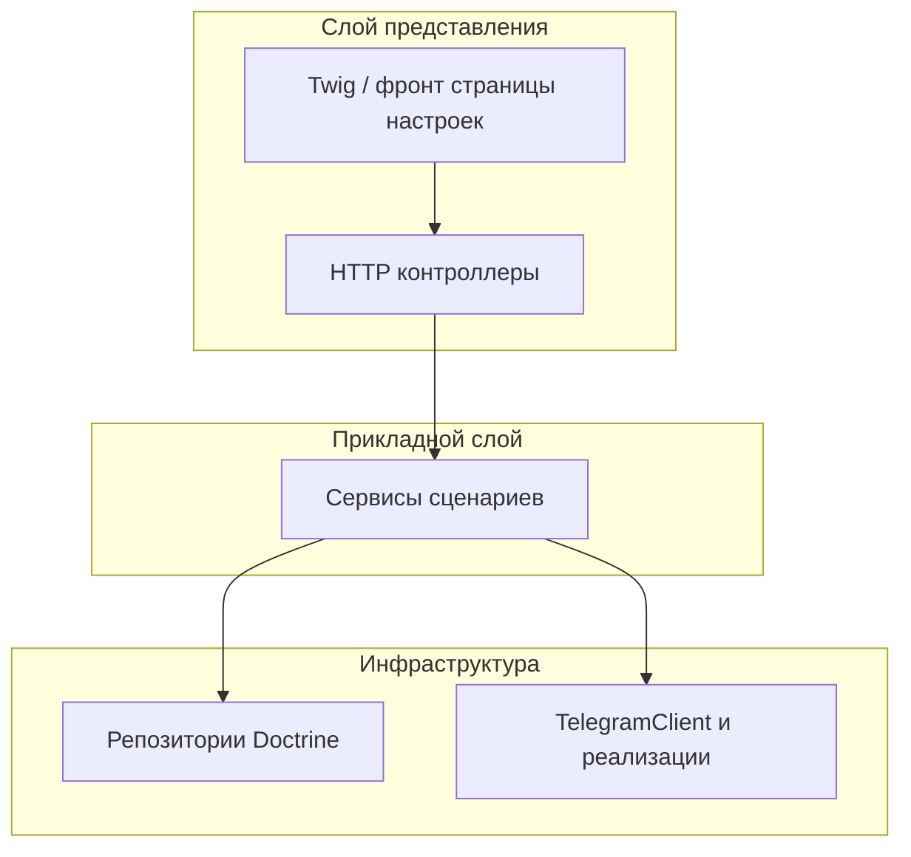

# Архитектура проекта

Документ фиксирует целевую архитектуру MVP интеграции с Telegram для магазинов Posiflora **в контексте full-stack приложения на Symfony 8**. Функциональные требования и контракты данных — в [ТЗ.md](./ТЗ.md); порядок внедрения — в [План реализации MVP.md](./План%20реализации%20MVP.md).

## Назначение и границы

Приложение — backend (и минимальный UI) для подключения бота магазином, настройки чата уведомлений и отправки сообщений о новых заказах. Заказ в системе создаётся через эмуляцию API; внешняя POS-система в контур MVP не входит.

## Технологический стек

| Слой | Технология |
|------|------------|
| Runtime | PHP 8.4+, Symfony 8 |
| HTTP API и веб | Symfony Framework, Serializer, Validator |
| Данные | Doctrine ORM 3, PostgreSQL, миграции |
| HTTP к внешним API | Symfony HttpClient |
| UI MVP | Twig, Asset Mapper, Stimulus (при необходимости UX-бандлы) |
| Локальная инфраструктура | Docker Compose ([README.md](./README.md)) |

## Каркас Symfony (full-stack)

Архитектура **задумана и описана под стандартное приложение Symfony**, а не под «голый» PHP:

- **Точка входа** — `public/index.php` загружает `App\Kernel`, дальше работает стек HttpKernel (маршрутизация, контроллер, события, ответ).
- **Конфигурация** — каталог `config/`: бандлы (`config/bundles.php`), `services.yaml` (автопроводка и автоконфигурация классов из `src/`), пакеты в `config/packages/` (Doctrine, Framework, Twig, Validator, Serializer и т.д.).
- **HTTP API и страницы** — контроллеры как сервисы (атрибуты маршрутов, внедрение зависимостей); при необходимости Twig для HTML и JSON через Serializer.
- **Данные** — Doctrine ORM подключается через DoctrineBundle; миграции и `DATABASE_URL` — типовой для Symfony способ.
- **Внешние вызовы** — обёртка над Symfony HttpClient в инфраструктуре (`TelegramClient`), а не прямые вызовы из контроллера.
- **Тесты** — Kernel/Web окружение Symfony для интеграционных проверок.

Слои (ниже) **накладываются на этот каркас**: прикладные сервисы — обычные классы в `src/`, зарегистрированные контейнером; смена реализации Telegram — правка DI (`services.yaml` / атрибуты), а не условная логика в контроллере.

## Принцип слоёв

Зависимости направлены сверху вниз: точки входа не обращаются к БД и к Telegram напрямую.

- **Представление** — маршруты, десериализация/валидация входа, формирование HTTP-ответов и страница настроек.
- **Прикладной слой** — правила: upsert интеграции, создание заказа, решение «слать / не слать», идемпотентность по журналу отправок, запись результата без отката уже созданного заказа при ошибке доставки.
- **Инфраструктура** — персистентность и вызов Telegram Bot API за абстракцией интерфейса клиента.

Интерфейс клиента Telegram позволяет подменять реальную отправку моком (тесты и локальная разработка) через контейнер зависимостей Symfony.

## Структура каталогов `src/` (целевая)

Ориентир для размещения кода MVP (имена пакетов могут уточняться, смысл — сохранить разделение ответственности):

- `Controller/` — входные HTTP-эндпоинты и при необходимости отдача страницы настроек.
- `Entity/`, `Repository/` — модель данных и доступ к ней.
- Прикладная логика — отдельные классы-сервисы (например `Service/` или `Application/`), без смешивания с сущностями и без HTTP.
- `Telegram/` (или аналог) — контракт `TelegramClient`, HTTP- и мок-реализации.

Миграции — `migrations/`; фикстуры или команды сида — по соглашению команды (`src/DataFixtures/` или `src/Command/`).

**Текущее состояние репозитория:** в `src/` развёрнут каркас Symfony (`Kernel.php`); доменные классы появятся по мере реализации плана.

## Внешние системы

- **PostgreSQL** — единственное хранилище состояния MVP.
- **Telegram Bot API** — исходящие запросы только через реализацию `TelegramClient`; URL и формат тела запроса инкапсулированы там.

## Ключевые качественные требования

- **Идемпотентность доставки** — на уровне БД (уникальное ограничение) и логики сервиса: повтор операции не приводит к повторной отправке и не дублирует журнал.
- **Устойчивость** — сбой Telegram не отменяет успешно созданный заказ; результат попытки фиксируется в журнале.
- **Конфигурация** — переключение режима отправки и параметры окружения задаются через переменные окружения и `config/packages/` без жёсткой привязки в коде сервисов.

## Развёртывание

Локально: БД через Compose, приложение — PHP built-in / Symfony CLI или контейнер приложения после появления Dockerfile в плане MVP. Детали портов и переменных — в корневом README и [README.md](./README.md) папки `doc/`.

## Связанные документы

- [ТЗ.md](./ТЗ.md) — что строим.
- [План реализации MVP.md](./План%20реализации%20MVP.md) — во что декомпозировать работу.
